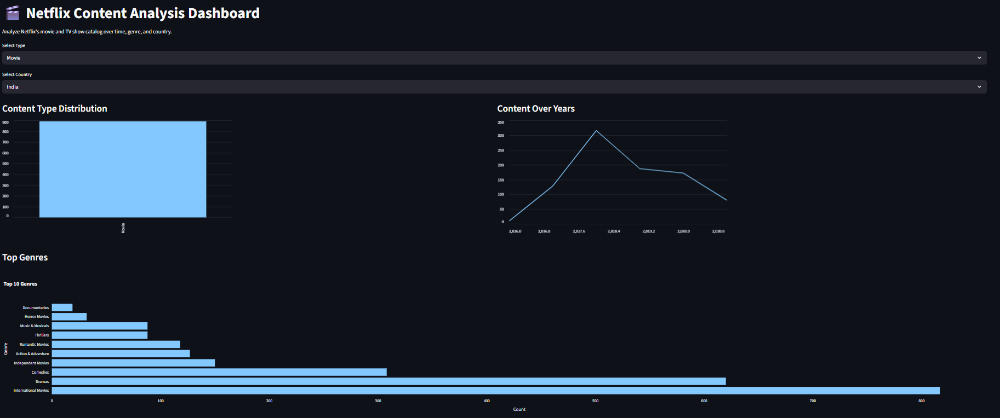

# 🎬 Netflix Content Analysis Dashboard
## 📊 Project Overview

An interactive Streamlit dashboard designed to explore and analyze Netflix's global content library. This project showcases how Python, Streamlit, and Plotly can be used to turn entertainment data into actionable insights about genres, countries, and content trends over the years.

---

## 🎯 Objectives

- Analyze content distribution by type (Movies vs TV Shows).
- Explore country-wise content availability.
- Visualize content growth over the years.
- Identify the most popular genres on Netflix.

---

## 📈 Key Insights

- **Dominant Type:** Movies account for the majority of Netflix content.
- **Top Genres:** Dramas, International Movies, and Comedies.
- **Peak Year:** 2018 had the highest number of new additions.
- **Top Countries:** United States and India lead in content availability.

---

## 📂 Dashboard Preview

 <!-- Replace with actual path if hosted -->

---

## ⚙️ Tools & Technologies Used

- **Python 3**
- **Streamlit** – Web framework for interactive dashboards
- **Pandas** – Data manipulation and cleaning
- **Plotly Express** – Interactive visualizations
- **Colab Notebook** – For initial EDA and preprocessing

---

## 📁 Files Included

- `netflix_cleaned.csv` – Cleaned Netflix dataset
- `app.py` – Streamlit app source code
- `Netflix_Content_Analysis_Dashboard.ipynb` – Notebook used for EDA and preprocessing
- `output.png` – Dashboard preview image

---

